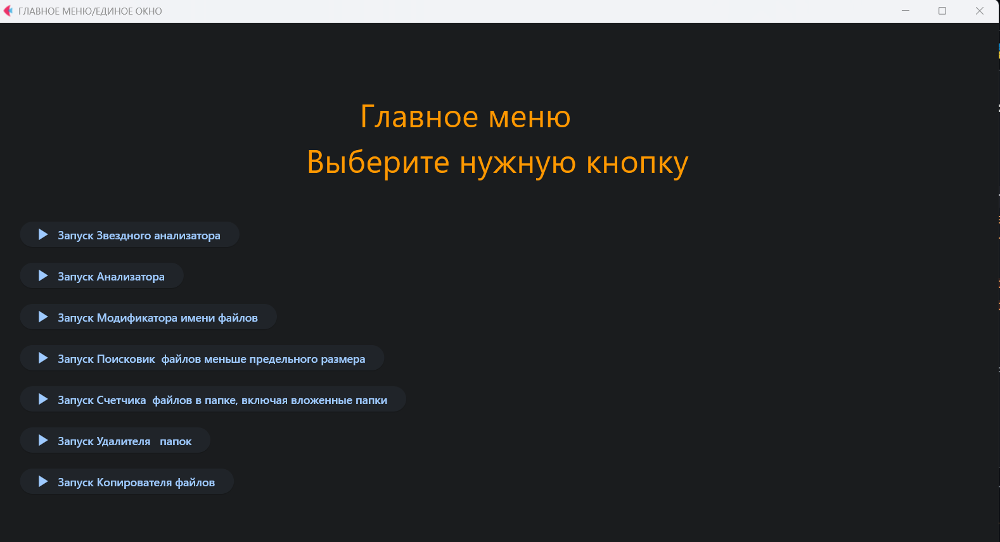
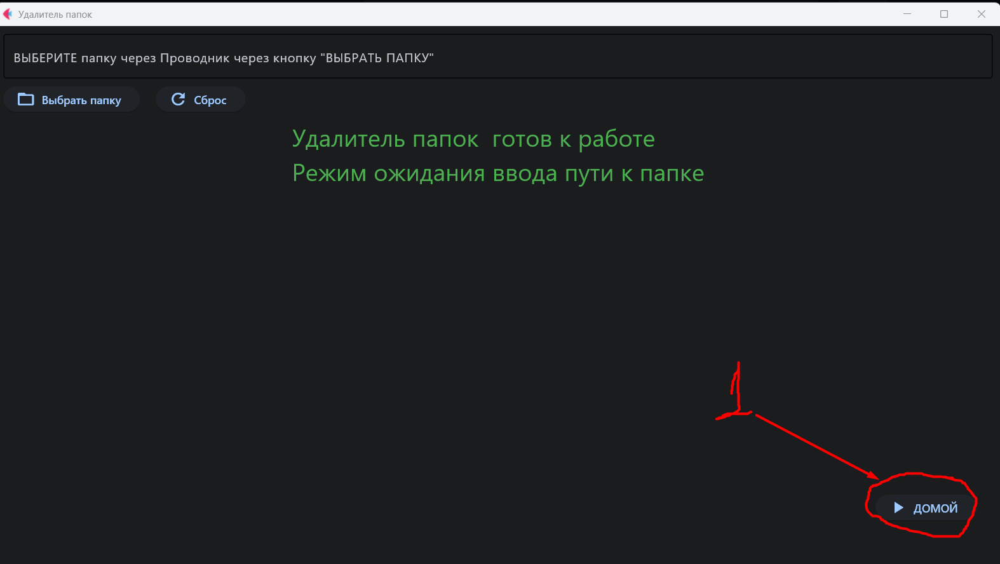

# Project1
Общие сведиения о проекте:

1. Проект состоит из двух частей:
   1.1 Базовая - содержит код 7 файлов фичей, находится в папке src/filesystem и 6 файлов  тестов на фичи находится в папке tests\
   1.2. Графическая -  содержит код 7 файлов с кодом графики для отображения фичей в окне библиотеки flet.
2. Технический стек описан в файле: requirements.txt
   2.1. Установка стека осуществляется в пакетном режиме через команду:
        pip install -r requirements.txt
        pip install -e .
3. Управление вызовом файлов:
   3.1 Вызовы фичей Базовой части по п.1.1 осуществляются из файла cli.py, командой из терминала:
    python cli.py <имя команды> <путь, если требуется>

   помощь вызывается командой из терминала:
    python cli.py -h
   подробно описано  в разделе Базовая часть.
    3.2. Также вызов возможен через модуль python -m, командой:
            python -m src.filesystem.cli_analize_files <путь> <*дополнительный параметр, если требуется> 
   3.3. Вызовы графики Графической части по п. 1.2 осуществляется из Единого окна нажатием на соответствующую кнопку.
   Единое окно реализовано в файле run_gui.py. 
   Запуск Единого окна командой из терминала:
   python run_gui.py:
   
    Возврат из графического окна выбранной соответствующей кнопкой фичи в Единое окно  реализован единообразно нажатием на кнопку "Домой", которая расположена на всех графических окнах фичей в правом нижнем углу.
    
4. Дополнительно к требованиям ТЗ разработаны: 
4.1. Возможность вызова фичей через интерактивное меню (подробно описано далее в разделе Базовая часть проекта).
4.2. Вывод результатов анализа фичей analize и star_ficha в файл форматы csv, report.csv и report_1.csv соответственно.
5.  Код проверен и отформатирован с помощью Ruff.

Базовая часть проекта
## Доступные команды

'### 1. Копирование файлов'
Команда позволяет создать копию указанного файла с постфиксом `_copy`.

**Запуск через CLI:**
powershell
python cli.py copy <имя_файла>
к примеру:
python cli.py copy test.txt

**Запуск через интерактивное меню:**

Запустите python main.py

Выберите номер пункта меню "1. Запустить копировальщик файлов" и введите его.
В открывшемся окне: 'Введите имя файла, который надо скопировать: '
введите имя файла, к примеру test.txt

'### 2. Удаление папок файлов'
Команда позволяет папку или файл по указанному пути.

**Запуск через CLI:**
powershell
python cli.py delete <путь к папке или файлу>
к примеру:
python cli.py delete C:\Users\ivano\Desktop\Project1\Total1 

**Запуск через интерактивное меню:**

Запустите python main.py

Выберите номер пункта меню "2. Запустить удалитель  файлов и папок" и введите его.
В открывшемся окне: 'Введите путь к папке или файлу: '
введите путь, к примеру C:\Users\ivano\Desktop\Project1\Total1

'### 3. Счетчик файлов'

Команда позволяет подсчитать количество файлов в директории, включая вложенные папки.

**Запуск через CLI:**
 powershell
python cli.py count <полный путь к директории> 
к примеру: 
python cli.py count C:\Users\ivano\Desktop\Project1\src

**Запуск через интерактивное меню:**
 powershell
 python cli.py menu

Выберите номер пункта меню "3. Запустить счетчик файлов" и введите его.
В открывшемся окне: 'Введите полный путь к директории, в который надо подсчитать количество файлов: " 
введите полный путь,
к примеру: C:\Users\ivano\Desktop\Project1\src

'### 4. Поисковик файлов'

Команда позволяет найти файлы в директории, включая вложенные папки, размер которых меньше заданного значения в килобайтах

**Запуск через CLI:**
 powershell
python cli.py find <полный путь к директории>
< размер файла в килобайтах> 
к примеру:
python cli.py find C:\Users\ivano\Desktop\Project1\src 100

**Запуск через интерактивное меню:**
 powershell

 python cli.py menu

Выберите номер пункта меню "4. Запустить поисковик файлов" и введите его.
В открывшемся окне: 'Введите полный путь к директории, в который надо найти файлы, размер которых меньше заданного в командной строке значения: "
введите полный путь, к примеру:
C:\Users\ivano\Desktop\Project1\Total

Далее откроется окно: 
'Введите значение размера, меньше которого будет размер найденных файлов: '
введите число, к примеру: 100

'### 5. Установщик даты к  имени файлов  '

Команда позволяет в имена  файлов в директории, опционально по параметру --recursive -  включая вложенные папки, вставлять дату создания файла.

**Запуск через CLI:**
 powershell
python cli.py modif <полный путь к директории>
< размер файла в килобайтах> 
к примеру:
1. Без вложенных папок:
python cli.py modif C:\Users\ivano\Desktop\Test_Project1\Project1\Total1
2. Во вложенных папках в том числе:
python cli.py modif C:\Users\ivano\Desktop\Test_Project1\Project1\Total1 --recursive

**Запуск через интерактивное меню:**
 powershell

 python cli.py menu

Выберите номер пункта меню "5. Запустить установщик даты в имя файла" и введите его.
В открывшемся окне: 'Введите полный путь к директории, в который надо добавить дату создания в файлы: " введите полный путь, к примеру:
C:\Users\ivano\Desktop\Project1\Total1
Далее откроется окно: 
'Введите параметр для вложенных папок --recursive: '
введите с клавиатуры "--recursive" 
или 
нажмите Enter для ввода даты только в корневых файлах

'### 6. Анализатор директории '
Команда выводит полный размер директории, имена и размер корневых папок, имена и размер корневых файлов.
**Запуск через CLI:**
 powershell
python cli.py analize <полный путь к директории>

к примеру:
python cli.py analize C:\Users\ivano\Desktop\Project1\src 

**Запуск через интерактивное меню:**
 powershell

python cli.py menu

Выберите номер пункта меню "6. Запустить анализатор" и введите его.
В открывшемся окне: 'Введите полный путь к директории, выбранной для анализа: ' 
введите полный путь к директории, к примеру:
C:\Users\ivano\Desktop\Project1\Total

'### 7. ЗВЕЗДНЫЙ Анализатор директории '
Команда выводит полный размер директории, имена и размер корневых папок, имена и размер корневых файлов и ПРОЦЕНТ занимаемого объема от полного размера директории
**Запуск через CLI:**
 powershell
python cli.py star <полный путь к директории>

к примеру:
python cli.py star C:\Users\ivano\Desktop\Project1\src 

**Запуск через интерактивное меню:**
 powershell

python cli.py menu

Выберите номер пункта меню "7. Запустить ЗВЕЗДНЫЙ анализатор" и введите его.
В открывшемся окне: 'Введите полный путь к директории, выбранной для анализа: ' 
введите полный путь к директории, к примеру:
C:\Users\ivano\Desktop\Project1\Total

-----------------------------------------
'Тесты, которые подтверждают работоспособность фичей'
-----------------------------------------
1. Тесты по копировальщику файлов

2. Тесты по удалителю папок

3. Тесты по счетчику количества файлов
    
4. Тесты по поисковику файлов
    
5. Тесты по добавлению даты в имена файлов

6. Тест по анализатору директорий.

7. Тест на проверку интеграции вызова.

8. Тест по ЗВЕЗДНОМУ анализатору директорий не разработан.
Тестирование Звездного анализатора на текущем этапе проводится вручную через GUI/CLI. Автоматизированный тест запланирован в следующем спринте»

--------------------------------------------------------
Графическая часть
--------------------------------------------------------
Вызовы графики Графической части по п. 1.2 осуществляется из Единого окна нажатием на соответствующую кнопку.
   Единое окно реализовано в файле run_gui.py. 
   Запуск Единого окна командой из терминала:
   python run_gui.py
1. Графика фичи Звездочка реализована в файле show_star_gui.py.
2. Графика фичи Анализатор реализована в файле show_analize_gui.py.
3. Графика фичи Модификатор реализована в файле show_modif_gui.py.
4. Графика фичи Поисковик реализована в файле show_find_gui.py.
5. Графика фичи Счетчкик реализована в файле show_count_gui.py.
6. Графика фичи Удалитель реализована в файле show_delete_gui.py.
7. Графика фичи Копирователь реализована в файле show_copy_gui.py.
